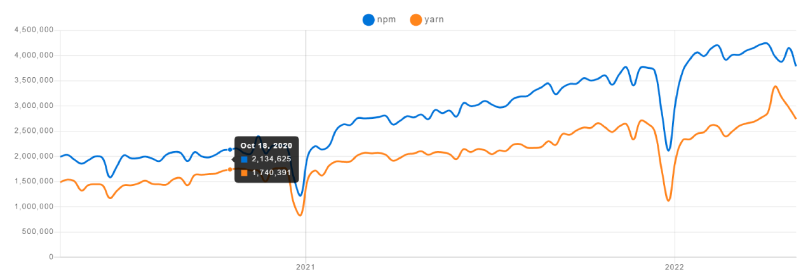
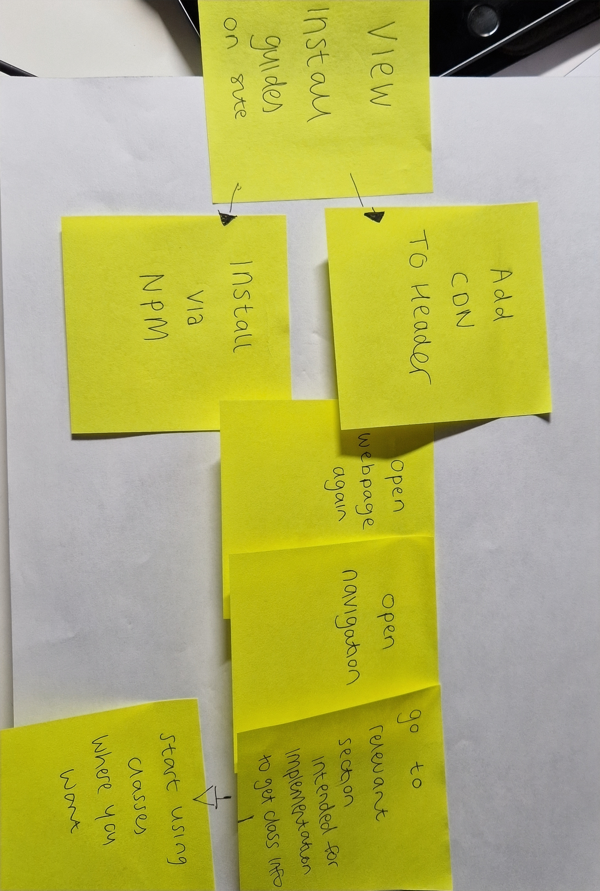
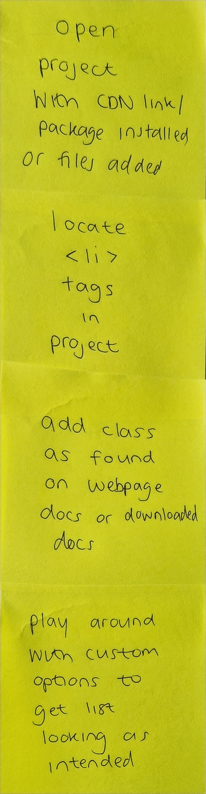

### Sprint 1 
5th October - 26th October
In this sprint it was attempted to identify goals of the project, get a good grasp on the background of why this project is necessary and narrow in on the target audience for the framework.  This will setup nicely into establishing the key functionality of the system especially following extensive research into various other frameworks. Recognising strong-points and the weaknesses in existing systems is key to making this new framework optimal. The key deliverables and realisations from this sprint were that this framework will use SCSS/SASS, the key functionality was identified as well as grasping a better understanding of designing  for dark mode. 

### Methodology completion
This project will implement Kanban principles. Kanban is a more visual way to organise tasks. It communicates clearly priorities and where each task is along the pipeline, it's easy to identify where tasks are being held up.  It will work best for this project as there are less time constraints. On smaller projects, Kanban is ideal for implementation. Outlining tasks specifically and defining work-in-progress are key parts of Kanban. 

### NPM, Yarn or CDN
A package manager, like Yarn or NPM, is used to organise and control what extra services and software are installed in your folder or project, 
  
NPM is the standard for node dependencies. It allows users to download, organise and use existing libraries, frameworks or software for their node project. Any existing software as listed on the Node registry can be installed and located using NPM. The modules installed via NPM help aid in the development process, meaning developers are not starting from scratch with every project. When running npm you use npm install to load in dependencies and they will be added to a package,json which is intrinsic to your project, meaning you are available to immediately start using installed modules.
  
Yarn is a JavaScript package manager, yarn is built on top of the NPM registry meaning any packages that are used in NPM can be carried over to Yarn. Yarn was built to improve some of NPM's shortfalls. It quickens up offline package installation for example. Yarn heightened security checks while downloading packages, something that was a weak point for NPM.

As is demonstrated above, NPM remains more popular than Yarn, which justifies optimising the framework for NPM, however, Yarn is not significantly behind to warrant ruling it out entirely.
  
Another possibility for actually using the framework is through a CDN, CDN's are quick with good response times, usually reliable (unless you want any offline functionality), easy to use and they're public and free. Often with more popular CDN's users have them cached in browser already which eliminates any potential hiccups or wait times. It makes sense to offer a variety of ways for people to implement a library or framework.
  

### Minified CSS
Minified CSS involves removing spaces from code to get the space and size of a file down, this improves site performance and speed. It can also save bandwidth. ["Minification can reduce file size by as much as 60%".](https://www.imperva.com/learn/performance/minification/#:~:text=Minification%20dramatically%20improves%20site%20speed,usage%20while%20surfing%20the%20web.) It's standard to put CSS or JS through minification to optimise it for web use. Site speed is something of major configuration when developing anything for web. It should be quick with no delays as they increase the likelihood of a consumer clicking off the page. Anything to have a site as lightweight and quick as possible should be undertaken.
  There are many tools that help with the minification of CSS, it's possible to install a package using npm or using an online one that you can put your readable CSS with proper syntax into and it'll return the minified version.  Tools like clean css or Dan's Tools CSS minifier are available to remove unneeded spaces.

### Use case stories

 
##### Downloading source files to use the framework

 
1. user downloads the source files
2. the user chooses their preferred way to import the files (entire library via the minified version or if they only want a select part of the framework choose that)
3. the user moves these relevant files over to their project
4. opens the docs file that is in the downloaded source files
5. user presses ctrl+f and searches for the relevant section they want 
6. user starts working with the framework
 
##### Using CDN or NPM to include the framework
 

 
1. user naviagates to the webpage relevant for the framework
2. they choose what way they want to include the framework (npm install or cdn)
3. the user performs tasks as laid out in the installation guide on the webpage
4. the user returns to the webpage
5. the user opens the navigation on the site
6. the user opens the section relevant to what they want to incorporate
7. the user starts using these classes in their projects.
##### Including divs for grid system
 

 
1. the user opens their project with the imported files (in whatever way they chose)
2. they use the relevant classes as visible in the docs on their files
3. they add classes for the grid to their divs 
4. the user opens these webpages in browser 
5. the user tests out the responsiveness of the grid
##### Include li / ul classes
  

 
1. the user opens the project with the css files for the framework incorporated in a way of their choosing
2. the user located the ul and li tags for a list in their project
3. the user adds classes as specified in online docs on to their ul
4. the user has full customisability of the classes so plays around to get the desired look and feel
##### Choose template to include and use 
 

 
1. The user opens the webpages for the template on the framework website
2. The user chooses 1 of the options to implement
3. The user downloads the template package files (which come bundled with relevant css framework files)
4. The user opens this package in their chosen code editor
5. The user inserts their own content into the sections and tweaks the layout as they see fit
 
### File package structure

The most organised way to download source files is to have every component in its own file. This allows users to only install what they want and only include what they need thus minimising bloat on their site. There will be a full minimised version of the file also with all relevant classes included. 
 
If one chooses to download the source files, they will include a document file that outlines relevant classes and information for implementation, a scss modular folder that includes all relevant components in separate files (eg. buttons.scss, dropdown.scss), a js folder with relevant js files and then the minimised files. Users have choice of including everything via the minimised file to save space ot to add only the components they intend to use. 