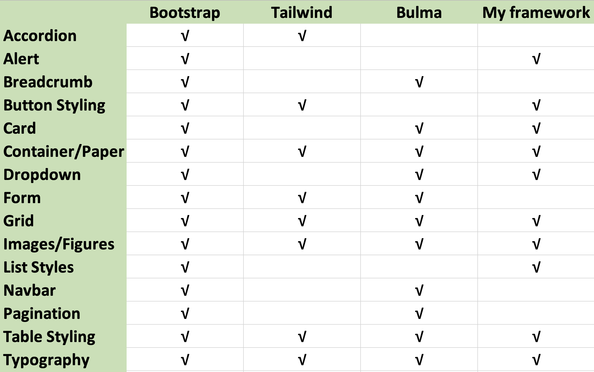

### Project Title
Custom UI Component Library / CSS Framework

#### Attendees
Kate O'Neill
Deirdre O'Halloran

#### Week Ending
Sun 23 October

#### Work Undertaken

##### What functionality do other frameworks offer and then what will mine offer?

**Functionality I want my framework to have**
- Alerts
- Button Styling
- Card
- Contained content / Paper
- Dropdown
- Grid
- Images
- List styles
- Table Styling
- Typography

##### Core features
- Mobile-first design
- Responsive design
- Good hover/active states styling on functionality
- Dark mode
- Functionality as listed above:
	- Alerts
	- Button Styling
	- Card
	- Contained content / Paper
	- Dropdown
	- Grid
	- Images
	- List styles
	- Table Styling
	- Typography
*Details on importance of some of these on web in [[WeeklyLogThree]]*

#### Methodology
##### Agile
**What is it?**
A software development methodology that works on the principle of delivering work in small increments. It takes an iterative approach to development that relies on constant evaluation of the teams progress. A massive factor in agile development is having an ability to respond to any changes that may occur in the process. 
  
**Key concepts**

**Pros and Cons**
*PROS*
- **Quality** of projects are going to be improved as there is constant testing on softwares and collaboration between developers to get jobs done
- Projects are usually delivered in a **timely manner**
- Less time is caught up in writing up documentation and more time is spent developing, improving and testing projects.
- **Quality Assurance feedback** ensures that developers are constantly up to scratch and producing the highest quality assets.
- There is better **adaption to change** when required because of constant self and team evaluation
- Easy to **collaborate** with customers and colleagues. They have a level of trust with the client as they demonstrate any progress made or obstacles they've faced.
- There is **constant improvement**

*CONS*
- When switching your management style to agile there may be some **difficulty implementing the new system** immediately. Team members need time to acclimatise to using agile. Team leaders may find it difficult finding out where they fit in as agile is a lot more collaborative than other methodologies. 
- There's not as much emphasis in agile on producing **documentation**. As a result of this collating some documentation at the end of the project may take longer than it would have normally done if there was more periodic reviews specifically for documentation.
- This lack of documentation can also mean new team member struggle getting up to speed and understanding how this company works or how they are implementing agile
- It's harder to monitor progress because of the cyclical nature of agile.
- Feature creep can become a massive issue in agile as teams get sidetracked into introducing new functionality.
- Not all features are gonna fit in the cycle length so often they'll get neglected because they don't fit neatly into the system.
- Developers are stuck to one project even if they've completed a certain task for the current project at hand they just have to wait for the next cycle as they'll be needed in that
- Can be difficult to maintain team motivation if they're not seeing any progress.
  
**Frameworks**
-   Scrum
-   Kanban
-   Lean
-   Crystal
-   Extreme Programming (XP)
-   Feature-Driven Development (FDD)
-   Domain-Driven Design (DDD)
-   Dynamic Systems Development Method (DSDM)
-   ScrumBan
-   Agile-Waterfall/Hybrid Agile
-   Scrum XP Hybrid
