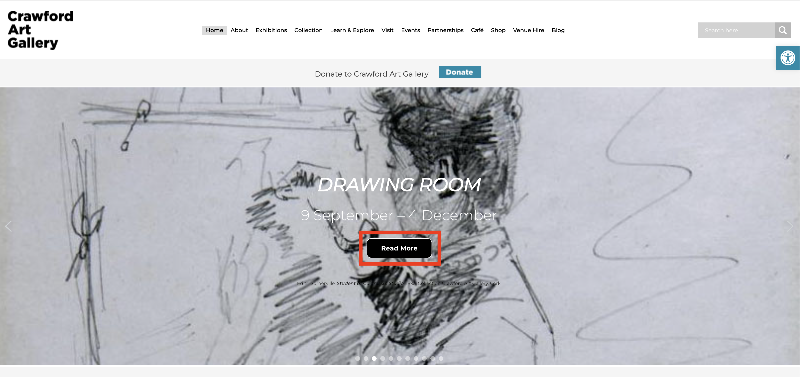

#### Weekly Log 3

- Installing The Live Sass compiler using VS Code and set up a local development environment using MAMP just to test out using some sass on basic divs and making use of the nested CSS.

##### Key Functionality
###### Grid
Any other frameworks have their own ***grid*** system which makes sense. *Mobile-first development* is such a huge area of any kind of app or web design. Popularised by Eric Schmidt in a Google conference. The reason it's mobile first is because of the amount of limitations you have on a smartphone screen, you start with the screen with the smallest area to play with and add more features and design as you work up to desktop. Mobile first design means you "focus on the core of your product and strip away the rest" [link](https://xd.adobe.com/ideas/process/ui-design/what-is-mobile-first-design/)The average smartphone size is 6.3" found [here](https://omdia.tech.informa.com/OM022757/Display-Dynamics--January-2022-Average-smartphone-display-size-stays-at-63-inches-while-the-resolution-can-be-potentially-enhanced#:~:text=Since%202021%2C%20the%20average%20has,6.3%2Dinch%20level%20since%202Q21.) where as the average laptop screen size is between 13.3 and 15" [here](https://voltfixer.com/average-laptop-screen-size/#:~:text=The%20average%20laptop%20screen%20size%20in%20the%20market%20is%2013.3,increase%20up%20to%2017.3%20inches.). That's a staggering difference in screen size and you want a memorable experience on either size. That's where grids come in. With mobile phone web usage only increasing year-on-year.  The need for this mobile-first approach is only increasing.
[https://www.oberlo.com/statistics/mobile-internet-traffic] 
 
The grid systems we know with Bootstrap, Tailwind or Bulma as outlined previously allow you to more easily design and develop for various display sizes. Grid systems can hinders outside the box designs as you want to keep it rigid to certain column widths etc. but it's simply a different way of thinking about design, some might say a more mathematical approach to design with fixed number of columns (typically 12 as it allows you to deal with both even and odd numbers on top of the grid) and gutter width to think about. 

###### Stylised Components
The grid is intended to be the foundation everything is built on in this scenario. On top of that we need to add some components that have pre-styled elements. Of course, I want some level of customisability with the elements but also want an approach where if someone were to enter bare-minimum class names, something would appear, somewhere between the out of the box styles of Bootstrap and the customisability of tailwind. 

- **Buttons** : Every site has buttons on to redirect you to different internal pages or different sections of the same page, You want them to stand out on your page to make them easily identifiable.  For marketing purposes having internal linking on your site is essential to boost your SEO scoring which will have you preferential in being the top results. Googles crawl bot "arrives at the website’s homepage, renders the page, and follows the first link" [link here](https://yoast.com/internal-linking-for-seo-why-and-how/) It's attempting to figure out relationships between pages and posts.

 The things highlighted in red are the internal linking buttons that are both linked very near the top of the homepage. In the second case it is integrated into the hero section of the webpage. This shows the importance of proper button styles.  A huge part of web design is the idea of a Call To Action (CTA) section. As is expected from the name, these sections are asking you to do something - buy this, subscribe here,  call us now, download our booklet. "Call to Actions are simple and effective ways to generate conversions and ultimately boost sales"[link here](https://www.sba.gov/blog/what-call-action-why-do-you-need-one-your-website). All buttons are effectively CTA's.  You'll notice the prominence of the buttons, the stark contrast from the background with the green makes our eye drawn to it and makes it stand out more to potential customers thus prompting us to sign up or download the app.

- **Cards**: It's usually an image and a heading followed by a small description along with it but it's more than that too. They're a nice way to display data and information in an organised manner. Often being clickable themselves, you want nice hover effects over any element. There are so many ways to display cards, your entire site could be card based (Pinterest) or you can use them to list products or your CTA's. 
 Real estate company using cards to list their properties for sale

 This danish company is using cards as the main part of their home page. 

 Leroy Merlin a homeware department store across Europe has an inspirational magazine for the french site and the product list in these gorgeous cards. 
  
Those are some examples of how one might choose to incorporate cards on their site. They're popular to include on sites as it can make your sites contents more digestible and easier to understand. Peoples attention spans are limited because of the instant gratification brought by the mass consumption of short-form content via social media. "The average user attention span in 2022 is just 8 seconds"[link](https://devrix.com/tutorial/user-attention-span-2022/).  "According to Hubspot, 55% of your visitors spend less than 15 seconds on your website"[link](https://www.openweb.com/blog/the-15-second-rule-whats-making-your-visitors-leave) Essentially, that's telling us that content needs to be visual and grab attention in that time and cards are interesting way to display that content so the user can find what they're looking for as quick as possible
  
*I think it could be interesting to impose a card grid thing to custom create a dashboard type display*

- **Images** : Every screenshot above had images on, they break up the rest of the content and draw users attentions far more than a block of text, every website will include some kind of graphics. There are SEO benefits to including images with relevant captions too. [link](https://www.logicdesign.co.uk/blog/4-reasons-images-important-website/) 
  
	I want to focus on background images as they are used arguably more often than one might think and getting them to behave as one wants is a lot of extra lines of code. 
 Mango is a popular clothing store, as you can see in the hero section of their site, their images are full-width and not contained. If i inspect this element it tells me they're inserting them as background images. 
 If you look closely in the right hand panel, you see the background image code along with a series of other lines.  
This one includes:
	- background-image
	- background-position
	- background-repeat
	- background-size
I want to be able to condense this down so you add one class and it will include all the code lines necessary.
  
Another example is on the fields.ie website. Their slider in the hero section includes background images:

They are including:
	- background-image
	- backgroundd-position-x
	- backgroundd-position-y
	- background-repeat

- **Table**:  The optimal way to display mismatched data. You need a variety of options for your table, need hover options for rows or columns depending on choice. There's a variety of additional designs to include in table design including things like freezing the header as you scroll, possible pagination on the table if there are too many rows and then the whole question of how to utilise them on mobile.  This table is displaying content about a bedside table on [jysk](https://jysk.ie/bedroom/bedside-tables/bedside-table-tapdrup-1-drawer-white). Very simple, clean way to display information that would otherwise be lost in a heavy paragraph.
- **List** : Lists are used for everything and the typical bullet list is falling out of favour. When on my placement we used list for social icons, even when they were being aligned horizontal, with a few different lines of CSS they were displaying as we wanted.   Lists can be really cool! This example from a danish art gallery displays the artists names in a list with a border top and border bottom, with a sleek font choice and hover effect, it easily elevates what we associate a list with, a bland few lines of text with bullet points. 

	    This example from the fanta website shows the social icons, displayed horizontally using a ul. 

- **"PAPER"**: I remember mui had one of these components that was essentially a div section with some simple stylings, i think that this is essential for my framework because I want to make it dark mode, when looking into designing a dark UI it emphasised the points of using different variants of darker colours and darker greys etc. I think this is arguably the easiest way to incorporate it, is put some kind of paper component with simple stylings and varying classes for a variety of greyscale colours. 

###### Typography
Typography is its own separate entity, a huge part of every website is choice typography because of how easily it can elevate any site. I want having responsive typography to be a central part of my framework, if one resizes their browser window the typography should resize with it, granted they have applied the relevant classes of course. 
  
Having applicable colours relevant in my colour scheme is also necessary for typography. Good typography establishes a [*strong visual hierarchy*](https://www.interaction-design.org/literature/topics/visual-hierarchy#:~:text=Building%20Blocks%20of%20Visual%20Hierarchy&text=Color%20%E2%80%93%20Bright%20colors%20typically%20attract,can%20suggest%20content%20is%20related.) which is so important in web design. [link](https://careerfoundry.com/en/blog/ui-design/beginners-guide-to-typography/#:~:text=Good%20typography%20will%20establish%20a,ensure%20an%20excellent%20user%20experience.) Styles are needed not only on headings but on captions, paragraphs, links, quotes and so on. Allowances for letter spacing in text, text-height altering, aligning text. Essentially covering a variety of lines of CSS one typically has to add or might consider adding on. 

 [link](https://www.g2.com/articles/visual-hierarchy) 

##### Designing for dark mode
Choosing dark mode is entirely preferential, some people enjoy the absence of harsh bright light when perusing online in any fashion. However, it's inclusion in design will not suit every website or application, you need to consider as with anything your core consumers or target audience and also the nature of your website. If you're an upcoming e-magazine aimed at young people then you might decide to try out a dark UI theme because it's popular in that age group. However if you're a gardening site aimed at retirees they mightn't be so au fait with dark themes and might find it harsh or hard to understand / read.
###### Colour scheme for dark mode
As with any website, dark modes are hard to design for, often you're throwing old principles out to cater for the indirect ones associated with dark UI themes. It involves rethinking the norm of UI design in some cases. Colour schemes for dark mode can be hard to navigate, some colours won't work over a grey gradient and others will cause eye fatigue. You want there to be sharp enough contrast too so your text or graphics aren't lost in the background. 
  
If I want to primarily design for dark themes, there needs to be different theme options and then that will pool in colours because too many accent colours gets cluttered and will not work. Think spotify, different dark grey/black gradients, white and the odd touch of their classic green colour.

Your base colour needs to be a grey variation, a direct black is not optimal. As is shown above, spotify is employing what are known as ["accented neutrals"](https://compilezero.medium.com/dark-mode-ui-design-the-definitive-guide-part-1-color-53dcfaea5129). This involves giving your greys a slight tint, in spotify's case this blue tint.  In terms of choosing accent colours for dark themed UI, you have to avoid using saturated colours as they ["visually vibrate against dark surfaces"](https://uxplanet.org/8-tips-for-dark-theme-design-8dfc2f8f7ab6). It is optimal to use lighter tones (colours in 200-50 range) for readability. Your text needs to meet contrast standards. ["WCAG 2.0 level AA requires a contrast ratio of at least 4.5:1 for normal text and 3:1 for large text."](https://webaim.org/resources/contrastchecker/#:~:text=WCAG%202.0%20level%20AA%20requires,3%3A1%20for%20large%20text.)   
To communicate depth in dark themes, varying greyscale colours should be used. As accent colours should be used sparingly, it's optimal to utilise grey and black variants to impose a hierarchy within your site.

 You can see in this page the using white to highlight key points and greying out the rest of the text and the minimal use of the neon green on the site too. The dark theme makes it look sleek and sophisticated, it wouldn't have the same response if it was on a light background.
  Just because you choose a dark theme doesn't mean you are stuck with using it everywhere, you can always create white sections within that. Take the guinness website, mostly black then a white footer and menu to break it up a little.  One of my favourite sites is [https://aaa24.a24films.com/](https://aaa24.a24films.com/), it's mostly in dark mode and sets up in a card grid system and then on hover you see the glimpses of the lighter tones come through, a classy, cool dark theme with hints of the lighter colours. They don't have to be mutually exclusive they can pair glamorously together. 

- I followed [this tutorial](https://youtu.be/pulxAOwPsY0) on Figma and created [this "prototype"](https://www.figma.com/file/25adRouGmcYkheuiqxOsiy/Music-App-Template-with-Illustrations-(Community)?node-id=1402%3A1111), just to test out using dark mode on figma on an existing template. I never used figma before so was trying to figure out the software a little as I went along. It is far from usable, but it highlights the using different dark shades for depth and then choosing 1/2 accent colours (the ones I chose didn't work but trial and error is a big part of UI design and seeing what sticks)
- I then messed around using scss an html to make the home screen (I did import bootstrap solely to use the grid for now, of course will get to the point of progress where i won't have to do that and will use my own one.) I only started doing this i.e barely finished the heading section but just to try experiment again with scss and get back up to scratch a little.